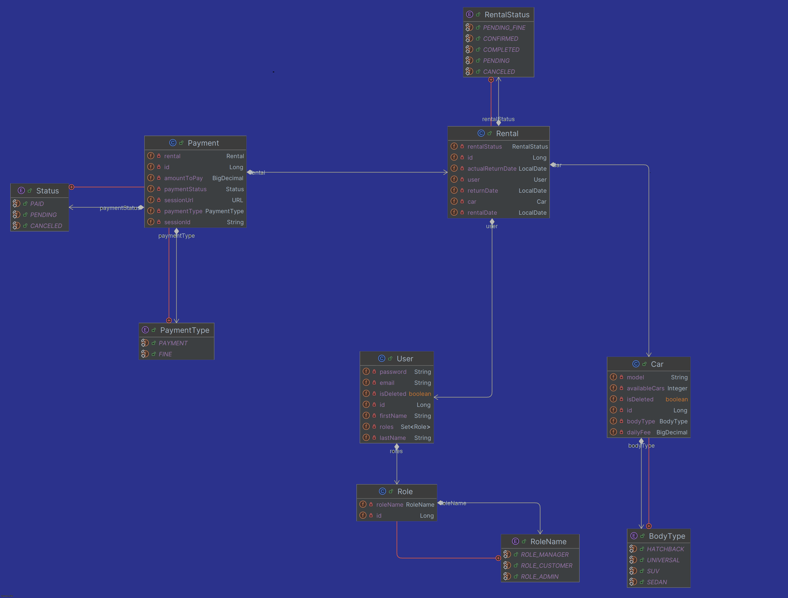

# Car Sharing App
This is a RESTful API for managing online car sharing. It allows users to rent cars, make payments 
using the Stripe API, and receive notifications about their activity via the Telegram app. 
The admin and manager can control CRUD operations on cars, manage rentals, view payments, 
and get user information, as well as change roles.

## **Technology stack:**

* **Language:** Java 24
* **Database & ORM:** MySQL 8.0.35, Hibernate 6.6.26.Final
* **Framework:** Spring Boot 3.5.5
* **Web Server:** Tomcat 10.1.44
* **Tools:** JUnit 5.12.2, Mockito 5.17.0, Maven 3.9.11, Test containers 1.21.3, Liquibase 4.29.2,
  Swagger 2.7.0, Docker 28.3.2, Lombok 1.18.40
* **External APIs:** Stripe (API & Java Client) 29.5.0, Telegram (API & Bots Client) 6.9.7.1

## Instructions
* Clone the [project](https://github.com/Vlad1507/car-sharing-app) on your computer. Use
  command:
```git clone command
git clone https://github.com/Vlad1507/car-sharing-app.git
```
or New > Project from Version Control > and add as url HTTPS or SSH (if it is configured), if
you use IntelliJ IDEA
```SSH
git@github.com:Vlad1507/car-sharing-app.git
```
* Create .env file in the root folder and specify your docker and local ports, add database connection information (you can pull out database from Docker HUB).
* To run docker is required to install Docker version 28.3.2 or higher

#### Example of .env file
```.env
STRIPE_API_SECRET_KEY=<insert-stripe-api-secret-key>
STRIPE_API_PUBLIC_KEY=<insert-stripe-api-public-key>
TELEGRAM_BOT_TOKEN=<insert-telegram-bot-token>
TELEGRAM_ADMIN_CHAT_ID=<insert-telegram-admin-chat-id>

SPRING_LOCAL_PORT=8081
SPRING_DOCKER_PORT=8080
JWT_SECRET=<your-jwt-secret>
JWT_EXPIRATION=<insert-jwt-expiration>

MYSQL_DATABASE=<your-database-name>
MYSQL_USERNAME=<username>
MYSQL_PASSWORD=<insert-password>
MYSQL_ROOT_PASSWORD=123456789
MYSQL_LOCAL_PORT=3307
MYSQL_DOCKER_PORT=3306
DEBUG_PORT=5005
```

* Navigate to the root of the project folder using the terminal (command line) in the Docker Desktop application.
``` terminal
cd IdeaProjects/car-sharing-app
```
* Build docker image
```console
docker build -t your-image-name:tag .
``` 
* Start the docker containers using command:
```console
docker-compose up
```
* Default URI for docker server http://localhost:8081
* You can change the port you want in the .env file
* For local project usage required are next components:
    - Java 24 version or newer and Maven 3.9.11 version or newer.
    - The database can be applied from the container (pulled from DockerHUB).
    - If you run project locally you should use default URI http://localhost:8080

## **Functionalities**
* When application started you can access to Swagger documentation through the URL of your server.
  For example: http://localhost:8081/swagger-ui/index.html to get full information about endpoints.
* There are default admin and two users handled by the Liquibase changelog
  [file](src/main/resources/db/changelog/changes/08-insert-users.yaml)
* They are intended for development and testing purposes only without the need to manually
  register new users.

Admin User
```json
{
 "email": "vo_admin@gmail.com",
 "password": "5o964(6t356ut-a8934yt-34t"
}
```
Manager user
```json
{
 "email": "sam1spam@gmail.com",
 "password": "09)sp_aM31#"
}
```
Customer user
```json
{
 "email": "alice@gmail.com",
 "password": "noSilA12*-3"
}
```


### Endpoints for unregistered users
* **POST**:/api/auth/registration - User registration
* **POST**:/api/auth/login - User authentication

### Endpoints for ALL authenticated users
* #### <code style="color : ORANGERED">Car</code>
    * **GET**:/api/cars - Get list of cars
    * **GET**:/api/cars/{id} - Get information about car by the ID
  
* #### <code style="color : LIGHTGREEN">Payment</code>
    * **GET**:/api/payments?userId=... - Get all payments of user by the ID
  
* #### <code style="color : AQUA">Rental</code>
    * **GET**:/api/rentals?userId=...&isActive=... - Get rentals by user ID and whether the rental 
      is still active or not
    * **GET**:/api/rentals/{id} - Get rental by id
    * **DELETE**:/api/rentals/{rentalId} - Cancel pending rental

* #### <code style="color : PINK">User</code>
    * **GET**:/api/users/me - Return information about user
    * **PATCH**:/api/users/me - Update profile information 

### Endpoints for MANAGER or ADMIN
* #### <code style="color : ORANGERED">Car</code>
    * **POST**:/api/cars - Add new car
    * **PATCH**:/api/cars/{id} - Update car by the ID
    * **DELETE**:/api/cars/{id} - Delete car by the ID

* #### <code style="color : PINK">User</code>
    * **PATCH**:/api/users/{id}/role - Update user role

### Endpoints for CUSTOMER
* #### <code style="color : LIGHTGREEN">Payment</code>
    * **POST**:/api/payments - Create payment session
    * **GET**:/api/payments/successful?session_id=... - Return information about successful payment
    * **GET**:/api/payments/canceled?session_id=... - Return information about canceled payment

* #### <code style="color : AQUA">Rental</code>
    * **POST**:/api/rentals - Add new rental
    * **POST**:/api/rentals/{rentalId}/return - End rental

## Collection of Postman requests
For easily work with postman endpoints you can import .json [file](CarSharingApp.postman_collection.json) from root folder.

## Database Schema
